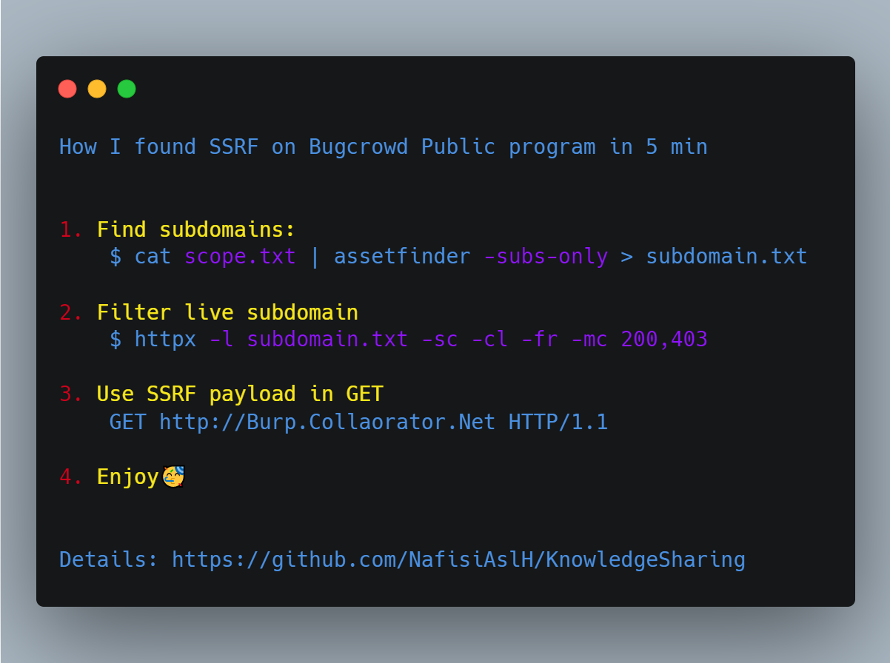
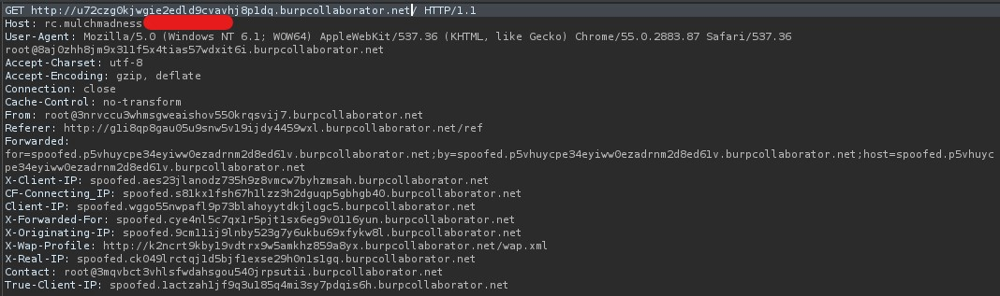
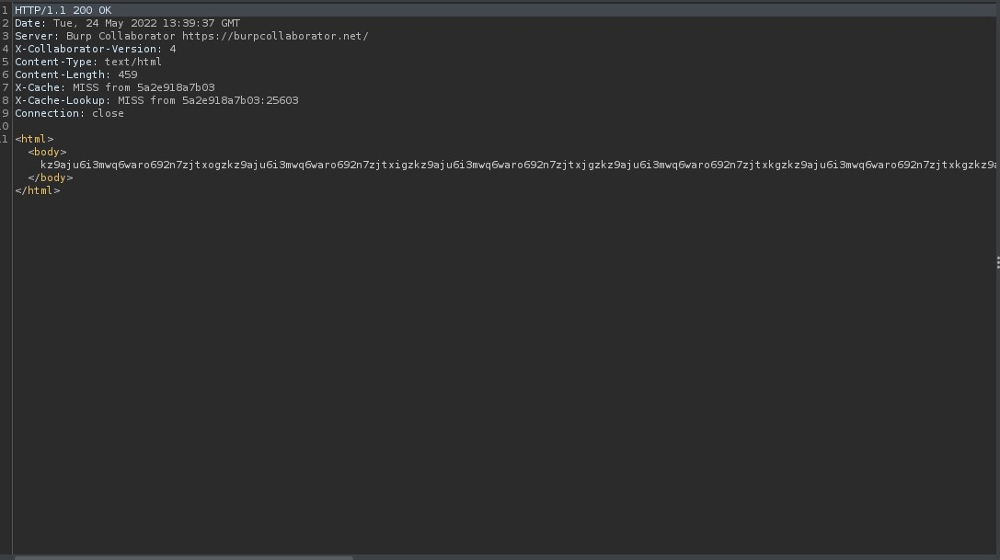

# ***How I found SSRF on Bugcrowd Public program in 5 min 🔥🔥🔥***

### *1. Find subdomains*
### *2. Filter live subdomain*
### *3. Use SSRF payload in GET*
### *4. Enjoy🥳*
 &nbsp;

 &nbsp;

----
## ***Credit***
Based on [Ittipatjitrada](https://medium.com/@ittipatjitrada_72022/how-i-found-ssrf-external-interaction-on-bugcrowd-public-program-in-5-min-9f51adca3f3e)'s write-up.

----
## ***Support***
You can Follow [me](https://www.linkedin.com/in/bhavesh-pardhi-/) on LinkedIn or
  
