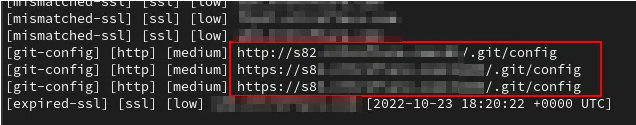
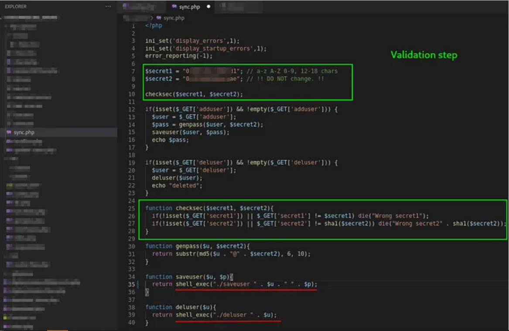
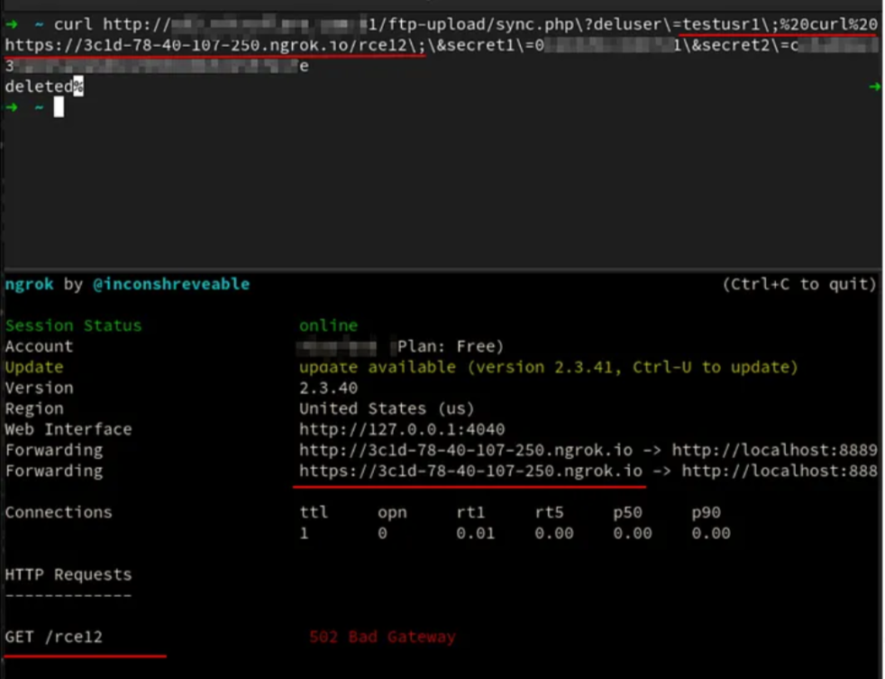

# ***$10.000 bounty for exposed .git to RCE***

### *1. Recon*
*Using chain of tools:*
```
amass enum -active -d $1 -brute -w ~/SecLists/Discovery/DNS/subdomains-top1million-110000.txt -o amass.txt
cat amass.txt | aquatone -ports xlarge -out aqua_$1
nuclei -l aqua_$1/aquatone_urls.txt -t ~/nuclei-templates -es info -o nuclei_$1.txt
```
*Fortunately, the output of nuclei showed me the exposed .git/ directories:*<br>
<br>
*Using the git-dumper tool to download the source:*
```
git-dumper http://example.com/.git/ output
```
<br>&nbsp;

### *2. Did not Rush*
*I thought this was a great opportunity to look for serious issues in the code and did not rush to report exposed .git*<br>
*And so it turned out that in the code they used a call to local bash scripts to save and delete ftp users via the shell_exec() function, which took an unfiltered userinput, which led to the RCE vulnerability*<br>
<br>&nbsp;

### *3. Preparing Exploit*
*To craft the request, I also had to take into account a simple validation that required hardcoded secret keys*<br>

<br>&nbsp;

### *4. Final Result*
*And the final result:
`http://example.com/ftp-upload/sync.php?deluser=INJECTION&secret1=[secret1]&secret2=[sha1 encoded secret2]`*

<br>&nbsp;

----
## ***Credit***
Based on [Lev Shmelev](https://medium.com/@levshmelevv/10-000-bounty-for-exposed-git-to-rce-304c7e1f54)'s writeup.

----
## ***Support***
You can Follow [me](https://www.linkedin.com/in/bhavesh-pardhi-/) on LinkedIn or
<br><br>[](https://www.buymeacoffee.com/bhaveshpardhi)
