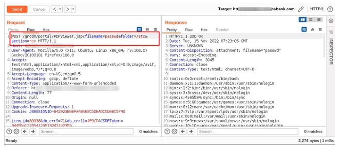
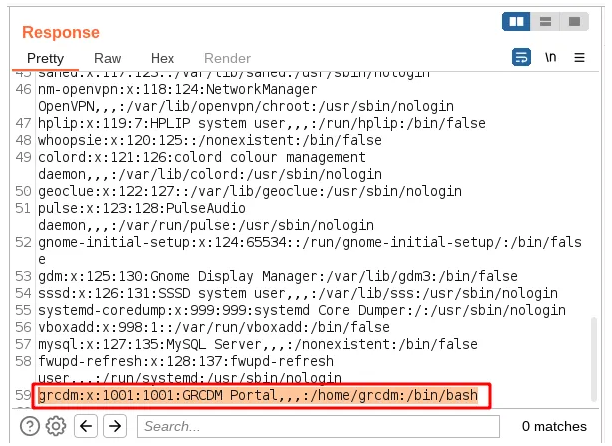
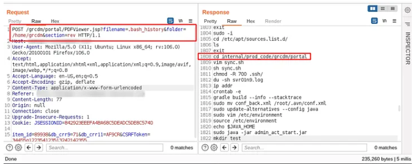
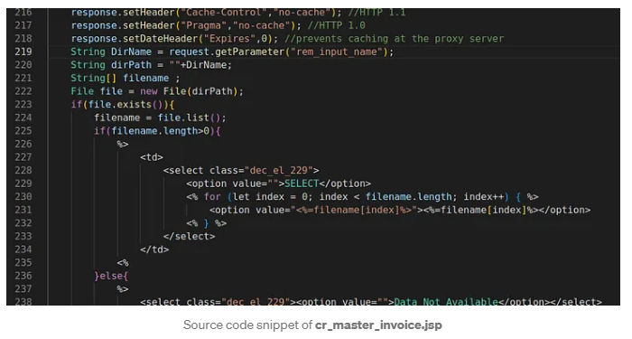
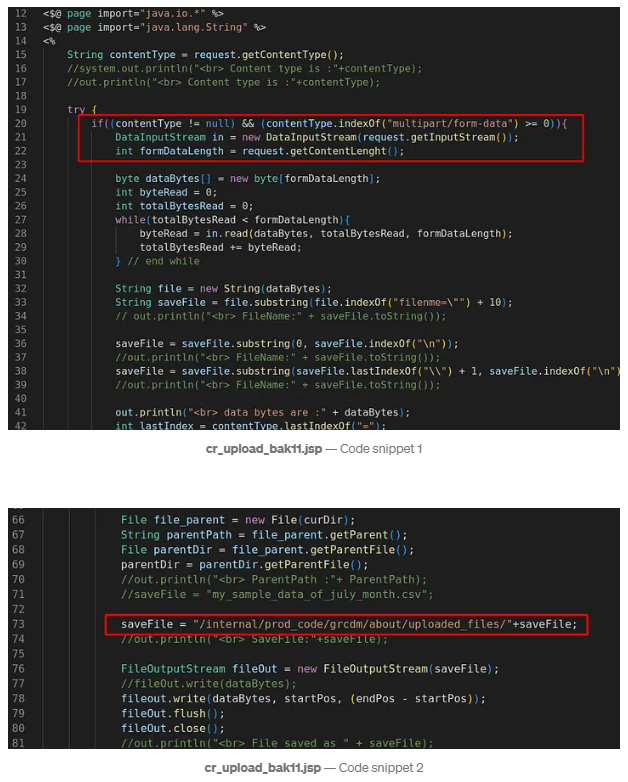
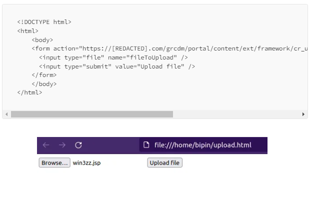

# ***Remote Command Execution in a Bank Server 👽***

### *Discovery 🔍*
*1. There was a functionality that user could download a PDF file* 
*2. Observe the filename and folder parameters in the request* 
*3. It was straightforward, send passwd  and /etc* 
*It's WORKED 🥳* 
 
 &nbsp;

### *Deep Dive 🔬*
 

*1. The app does not allow us to pass directory traversal payloads (‘../’, ‘%2e%2e%2f’)* 
*2. tried to get some default internal OS configuration files, but most of the files give an error.* 
*3. Looked at the passwd file again and saw an interesting 'grcdm' user.* 

 
 &nbsp;

### *Further exploration 🔦*
*1. I tried with ~/.bash_history payload (/home/grcdm and .bash_history)*  
*2. I got the complete command history of user 'grcdm'*  
*3. After analyzing all the commands, I found the web host’s root path.*
 
 &nbsp;

### *Analysis 🧩*
*1. I copied the names of all JSP pages using the Target Analyzer of the Burp Suite (Engagement Tools)*  
*2. Configured the intruder and set the attack point to the filename parameter.*  
*3. I found a Directory Listing. vulnerability in cr_master_invoice.jsp.*
 
 &nbsp;

### *Analysis 🧩*
*1. I passed ../../../../../../etc and saw that it listed all contents of etc directory.*  
*2. Crawled all folders with the help of internal directory listing.*  
*3. I saw an unlinked JSP file that was vulnerable to Unrestricted File Upload.*
 
 &nbsp;

### *Exploitation 💣*
*1. I quickly created an HTML file upload page and specified a vulnerable endpoint in the action attribute of the form tag.*  
*2. Opened the created HTML page in the browser and selected the JSP web shell to upload.*
 
 &nbsp;

----
## ***Credit***
Based on [Bipin Jitiya](https://medium.com/@win3zz/remote-command-execution-in-a-bank-server-b213f9f42afe)'s writeup.

----
## ***Support***
You can Follow [me](https://www.linkedin.com/in/bhavesh-pardhi-/) on LinkedIn or
  
